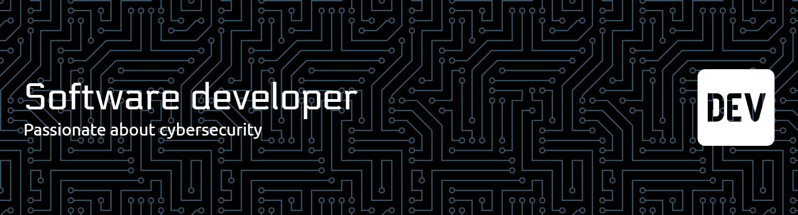

  

## 👋 Hi there! I'm Teddy Christian

I'm a passionate developer who loves building software and web application. I work mainly with PHP, Python, React/React Native, with growing focus on Cybersecurity ande the Cloud.

- 🔭 Currently working on: loading...
- 🌱 Learning: loading...
- 💬 Open to collaborations and always curious to learn.

---

## 🧰 Tech I use

- Languages: Python, JavaScript/TypeScript, PHP, SQL
- Frontend: Vue.js, React, React Native, Expo, HTML, Tailwind CSS
- Backend: Node.js, Express, PHP, Flask
- DevOps: Docker, Kubernetes (learning), GitHub Actions, CI/CD
- Databases: PostgreSQL, MySQL, SQLite, MongoDB

---

## 📊 GitHub stats

---

## 🔧 Featured Projects

- Galaxy Game — A 3D space runner [Repo](https://github.com/teddy-christian/galaxy-game) | [Live](https://galaxies.games/)

- Beat Maker — A desktop drum machine / beat sequencer [Repo](https://github.com/teddy-christian/beat-maker)

- Zone App v1 — A task management mobile app [Repo](https://github.com/teddy-christian/zone-app)
  

---

  Thanks for visiting — feel free to reach out via issues or discussions!

